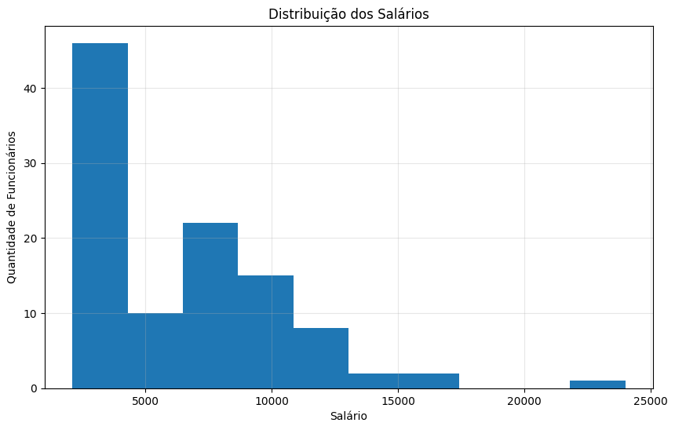
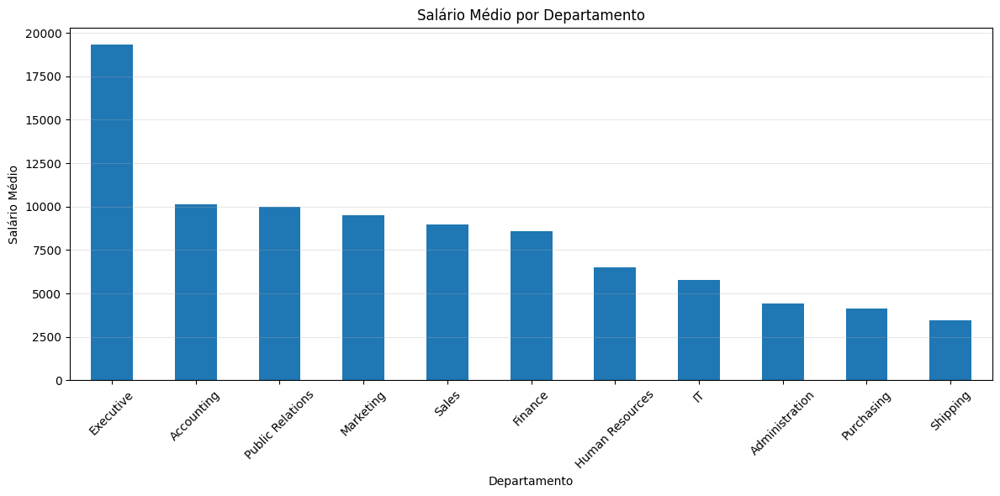
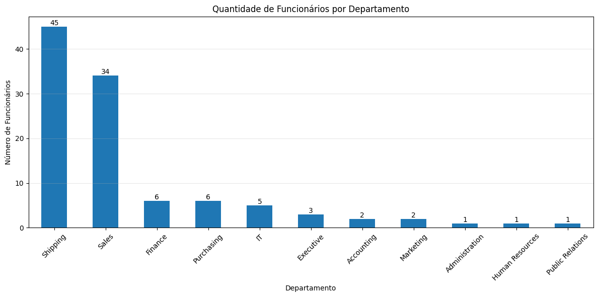
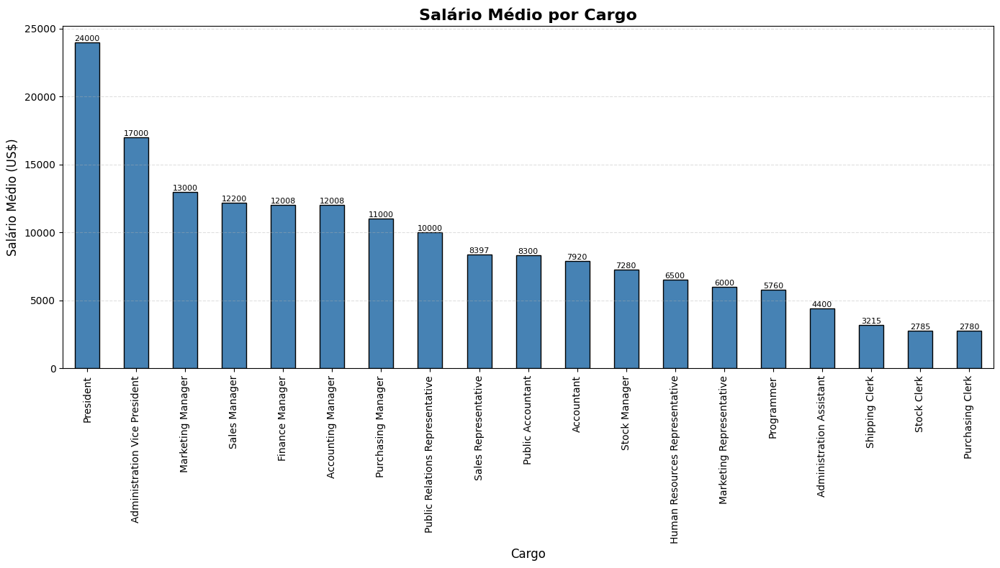
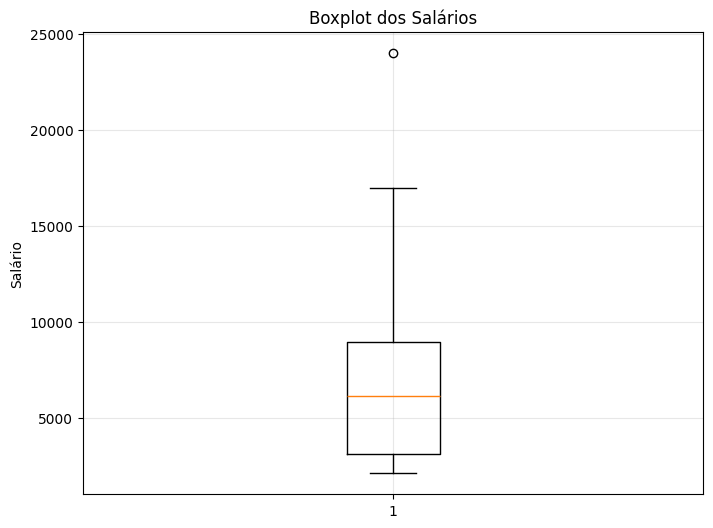
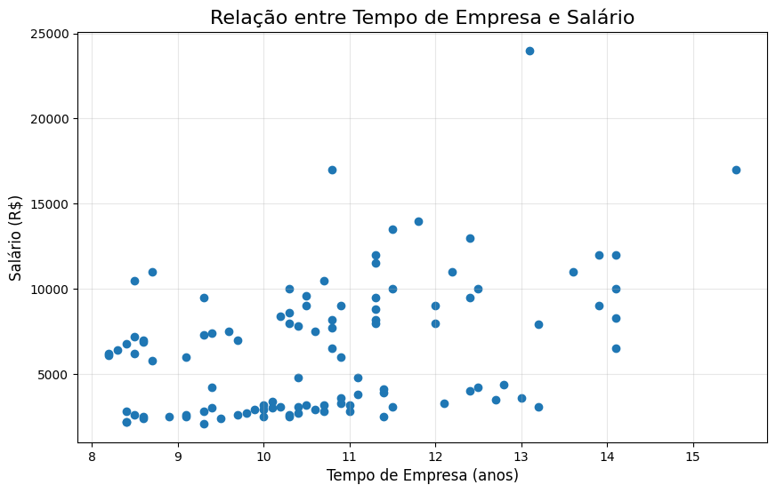

# Projeto Final — Análise de Dados Aplicado ao RH

> Projeto desenvolvido como parte da disciplina **Visualização de Dados e Business Intelligence**, utilizando **SQL**, **Python** e técnicas de **Análise Exploratória de Dados (EDA)** para transformar dados do banco de dados **HR (FreeSQL)** em informações estratégicas para apoio à tomada de decisão na área de Recursos Humanos.

# Informações do Projeto

**Aluno:** Luís Oliveira

**Turma:** T2

**Disciplina:** Visualização de Dados e Business Intelligence

**Professor(a):** Natália Arruda

# Objetivo

O objetivo deste projeto é aplicar conceitos de **Business Intelligence**, **SQL** e **Python** para realizar uma Análise Exploratória de Dados (EDA) sobre uma base de Recursos Humanos.

A proposta consiste em extrair informações do banco de dados HR utilizando consultas SQL, realizar o tratamento e análise dos dados em Python e apresentar insights que possam auxiliar gestores na tomada de decisões relacionadas à estrutura organizacional, remuneração e perfil dos colaboradores.

# Tecnologias Utilizadas

- Python 3
- Pandas
- Matplotlib
- Seaborn
- SQL
- FreeSQL
- Jupyter Notebook
- Git
- GitHub
- NotebbokLM


# Estrutura do Projeto

projeto-final-rh-bi/

│
├── dados/
│   ├── sql_1.csv
│   └── sql_2.csv
│
├── graficos/
│   ├── boxplot_salarios.png
│   ├── distribuicao_salarios.png
│   ├── quantidade_funcionarios_departamento.png
│   ├── salario_medio_cargo.png
│   ├── salario_medio_departamento.png
│   ├── scatter_tempo_salario.png
│   └── tempo_medio_departamento.png
│
├── notebooks/
│   └── analise_rh.ipynb
│
├── sql/
│   ├── sql_1.sql
│   └── sql_2.sql
│
└── README.md


# Fluxo do Projeto

```text
Banco HR (FreeSQL)
        │
        ▼
Consultas SQL
        │
        ▼
Arquivos CSV
        │
        ▼
Python + Pandas
        │
        ▼
Análise Exploratória (EDA)
        │
        ▼
Visualizações
        │
        ▼
Insights para o RH
```

# Base de Dados

O projeto utiliza o esquema **HR (Human Resources)** disponibilizado pelo ambiente **FreeSQL**.

Foram utilizadas as seguintes tabelas:

- EMPLOYEES
- DEPARTMENTS
- JOBS
- LOCATIONS
- COUNTRIES
- REGIONS

Essas tabelas foram relacionadas por meio de **LEFT JOIN**, preservando a integridade dos registros e permitindo uma visão completa da estrutura organizacional.

# Consultas SQL

Foram desenvolvidas duas consultas principais.

## SQL 01

Objetivo:

Relacionar funcionários, departamentos e cargos para análise salarial.

Resultado:

Arquivo **sql_1.csv**

## SQL 02

Objetivo:

Relacionar funcionários às regiões geográficas da empresa.

Resultado:

Arquivo **sql_2.csv**


# Etapas da Análise em Python

Durante a Análise Exploratória de Dados foram realizadas as seguintes etapas:

- Importação dos arquivos CSV
- Inspeção da base
- Identificação de valores nulos
- Estatísticas descritivas
- Conversão da coluna HIRE_DATE para datetime
- Criação da variável TEMPO_EMPRESA
- Agrupamentos utilizando GroupBy
- Distribuições estatísticas
- Visualizações gráficas
- Correlação entre variáveis


# Indicadores Gerais

| Indicador                     | Valor             |
|-------------------------------|------------------:|
| Total de Funcionários         | **106**           |
| Salário Médio                 | **US$ 6.456,75**  |
| Mediana Salarial              | **US$ 6.150,00**  |
| Menor Salário                 | **US$ 2.100,00**  |
| Maior Salário                 | **US$ 24.000,00** |
| Tempo Médio de Empresa        | **10,7 anos**     |
| Correlação Tempo × Salário    | **0,417**         |


# Visualizações

## Distribuição dos Salários

### Histograma




### Principais observações

- Concentração salarial abaixo de US$ 5.000
- Assimetria positiva
- Poucos salários elevados deslocam a média

## Salário Médio por Departamento




### Principais observações

- Executive apresenta a maior média salarial
- Shipping possui uma das menores médias

## Quantidade de Funcionários por Departamento




### Principais observações

- Shipping concentra a maior quantidade de colaboradores
- Departamentos estratégicos possuem equipes menores


## Salário Médio por Cargo




### Principais observações

- Os maiores salários concentram-se em cargos executivos
- Estrutura salarial compatível com a hierarquia organizacional


## Boxplot por Departamento




### Principais observações

- Sales e Marketing apresentam maior dispersão salarial
- Executive possui salários elevados e homogêneos
- Shipping apresenta diversos outliers


## Correlação entre Tempo de Empresa e Salário



### Principais observações

- Correlação positiva moderada
- Tempo de empresa influencia o salário
- O cargo exerce maior impacto na remuneração


# Perguntas Respondidas pela Análise

Durante o projeto foram respondidas as seguintes questões de negócio:

- Como os salários estão distribuídos na empresa?
- Qual departamento possui os maiores salários?
- Qual departamento concentra mais funcionários?
- Quais cargos apresentam as maiores remunerações?
- Existem departamentos com grande dispersão salarial?
- Funcionários mais antigos tendem a ganhar mais?
- Como a empresa está distribuída geograficamente?

# Principais Insights de Negócio

Após a análise exploratória foi possível identificar que:

### Estrutura Salarial

A empresa apresenta uma estrutura típica de pirâmide organizacional, concentrando grande quantidade de colaboradores em faixas salariais inferiores e poucos profissionais em cargos executivos.

### Diferenças entre Departamentos

O departamento Executive possui a maior média salarial, enquanto Shipping concentra a maior quantidade de funcionários e uma das menores remunerações médias.

### Dispersão Salarial

A utilização do Boxplot mostrou que alguns departamentos possuem elevada variação salarial, indicando diferentes níveis hierárquicos dentro da mesma área.

### Tempo de Empresa

A empresa apresenta colaboradores com elevado tempo médio de permanência, indicando estabilidade do quadro funcional.

### Correlação

A correlação de Pearson (0,417) demonstrou que existe uma relação positiva moderada entre tempo de empresa e salário, embora o principal fator de remuneração seja o cargo ocupado.


# Conclusão

A aplicação integrada de SQL, Python e técnicas de Business Intelligence permitiu transformar dados operacionais em informações relevantes para a gestão de Recursos Humanos.

A análise possibilitou compreender a estrutura salarial da empresa, identificar padrões entre departamentos e cargos, avaliar o perfil de permanência dos colaboradores e verificar que o tempo de empresa exerce influência moderada sobre a remuneração.

Este projeto demonstra como a Análise Exploratória de Dados pode apoiar decisões estratégicas relacionadas à gestão de pessoas.


# Possíveis Evoluções

Como continuidade deste projeto, podem ser implementadas novas análises, como:

- Dashboard interativo em Power BI
- Dashboard Web utilizando Plotly/Dash
- Análise de Promoções (JOB_HISTORY)
- Estudo de Equidade Salarial
- Indicadores de Turnover
- Modelos Preditivos utilizando Machine Learning

# Aprendizados

Durante o desenvolvimento deste projeto foram praticados conceitos de:

- SQL e relacionamentos entre tabelas
- Git e GitHub
- Pandas
- Estatística Descritiva
- Análise Exploratória de Dados (EDA)
- Visualização de Dados
- Correlação entre Variáveis
- Business Intelligence
- Documentação de Projetos


Este projeto foi desenvolvido com fins acadêmicos como parte da disciplina de **Visualização de Dados e Business Intelligence**, servindo também como demonstração prática das competências adquiridas em SQL, Python e Análise de Dados.